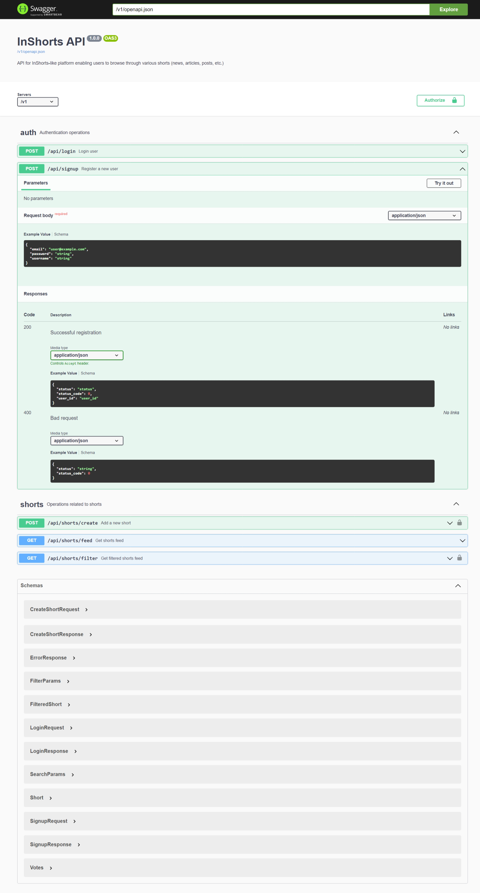

# InShorts API Server

API Documentation: https://inshorts-api-ugdzgasx3a-uc.a.run.app/v1/ui/



Try the API here: https://inshorts-api-ugdzgasx3a-uc.a.run.app/v1/ui/ (hosted on Google Cloud Run)

(e.g. endpoint https://inshorts-api-ugdzgasx3a-uc.a.run.app/v1/api/shorts/feed)

InShorts Sever Documentation - https://docs.google.com/document/d/1wrQ_6tHq2Ki8siFvD1XwwH9oV3ImHnVYQB3-BIlJ5q0/edit?usp=sharing \
The above documentation highlights the steps taken while building, obstacles faced and resolution and screenshots of manual tests performed on the API. \
This server is built with spec-first approach with Swagger and standards of OpenAPI initiative.

## Requirements

Python 3.5.2+

## Usage

To run the server, please execute the following from the root directory:

```
pip3 install -r requirements.txt
python -m swagger_server
```

and open your browser to here:

```
http://localhost:8080/v1/ui/
```

API Specification lives here:

```
http://localhost:8080/v1/swagger.json
```

## Running with Docker

To run the server on a Docker container, please execute the following from the root directory:

```bash
# building the image
docker build -t swagger_server .

# starting up a container
docker run -p 8080:8080 swagger_server
```

NOTE: Set the following environment variables appropriately before running the server

DB_USERNAME=username
DB_PASSWORD=password
DB_HOST=your-host-here
DB_NAME=db-name-here
JWT_SECRET_KEY=jwt-secret-here
